<picture><source media="(max-width: 600px) and (prefers-color-scheme: dark)" srcset="assets/v11/hero-mobile-dark.webp" /><source media="(max-width: 600px)" srcset="assets/v11/hero-mobile-light.webp" /><source media="(prefers-color-scheme: dark)" srcset="assets/v11/hero-dark.webp" />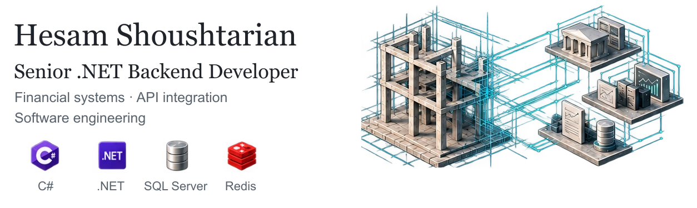</picture>

<a href="https://www.linkedin.com/in/hesam-shoushtarian/" title="LinkedIn — professional background and contact"><picture><source media="(prefers-color-scheme: dark)" srcset="assets/v7/nav-linkedin-dark.webp" /></picture></a>
<a href="projects/README.md" title="Complete project directory"><picture><source media="(prefers-color-scheme: dark)" srcset="assets/v7/nav-directory-dark.webp" /></picture></a>

<picture><source media="(max-width: 600px) and (prefers-color-scheme: dark)" srcset="assets/v10/title-atlas-mobile-dark.webp" /><source media="(max-width: 600px)" srcset="assets/v10/title-atlas-mobile-light.webp" /><source media="(prefers-color-scheme: dark)" srcset="assets/v10/title-atlas-dark.webp" />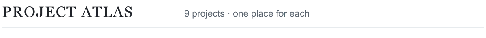</picture>

<a href="projects/beauty-commerce.md" title="Beauty Services and Commerce Platform"><picture><source media="(max-width: 600px) and (prefers-color-scheme: dark)" srcset="assets/v9/beauty-commerce-mobile-dark.webp" /><source media="(max-width: 600px)" srcset="assets/v9/beauty-commerce-mobile-light.webp" /><source media="(prefers-color-scheme: dark)" srcset="assets/v9/beauty-commerce-dark.webp" />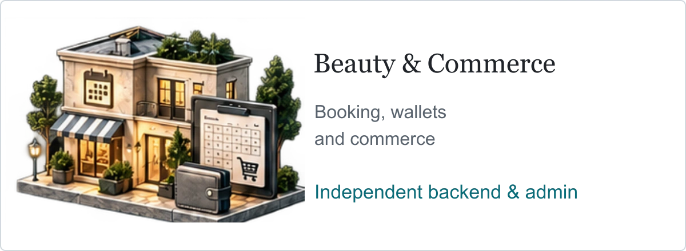</picture></a>
<a href="projects/api-simulation.md" title="Financial API Simulation and Administration Platform"><picture><source media="(max-width: 600px) and (prefers-color-scheme: dark)" srcset="assets/v9/api-simulation-mobile-dark.webp" /><source media="(max-width: 600px)" srcset="assets/v9/api-simulation-mobile-light.webp" /><source media="(prefers-color-scheme: dark)" srcset="assets/v9/api-simulation-dark.webp" />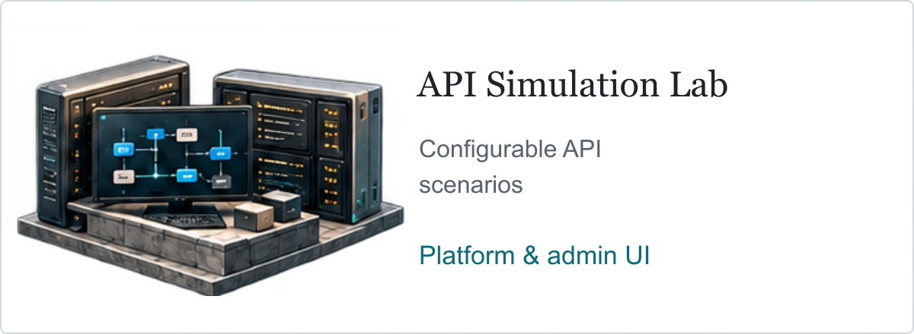</picture></a>

<a href="projects/credentials-tokens.md" title="Financial Credential and Token Management Service"><picture><source media="(max-width: 600px) and (prefers-color-scheme: dark)" srcset="assets/v9/credentials-tokens-mobile-dark.webp" /><source media="(max-width: 600px)" srcset="assets/v9/credentials-tokens-mobile-light.webp" /><source media="(prefers-color-scheme: dark)" srcset="assets/v9/credentials-tokens-dark.webp" />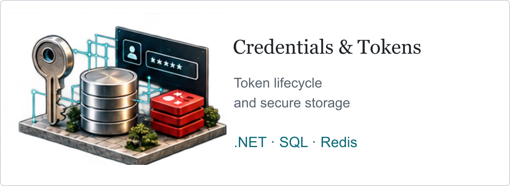</picture></a>
<a href="projects/fund-analytics.md" title="Fund Analytics Service"><picture><source media="(max-width: 600px) and (prefers-color-scheme: dark)" srcset="assets/v9/fund-analytics-mobile-dark.webp" /><source media="(max-width: 600px)" srcset="assets/v9/fund-analytics-mobile-light.webp" /><source media="(prefers-color-scheme: dark)" srcset="assets/v9/fund-analytics-dark.webp" />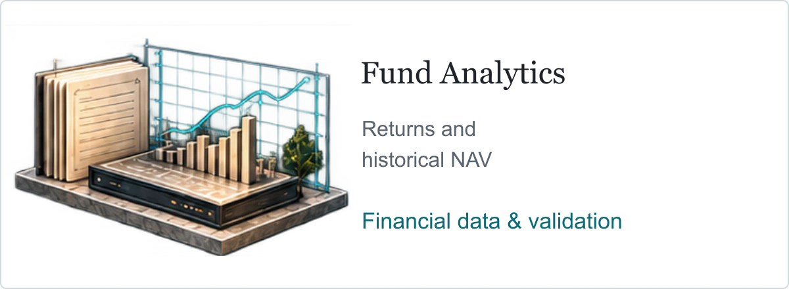</picture></a>

<a href="projects/interactive-training.md" title="Interactive Financial Workflow Training Prototypes"><picture><source media="(max-width: 600px) and (prefers-color-scheme: dark)" srcset="assets/v9/interactive-training-mobile-dark.webp" /><source media="(max-width: 600px)" srcset="assets/v9/interactive-training-mobile-light.webp" /><source media="(prefers-color-scheme: dark)" srcset="assets/v9/interactive-training-dark.webp" />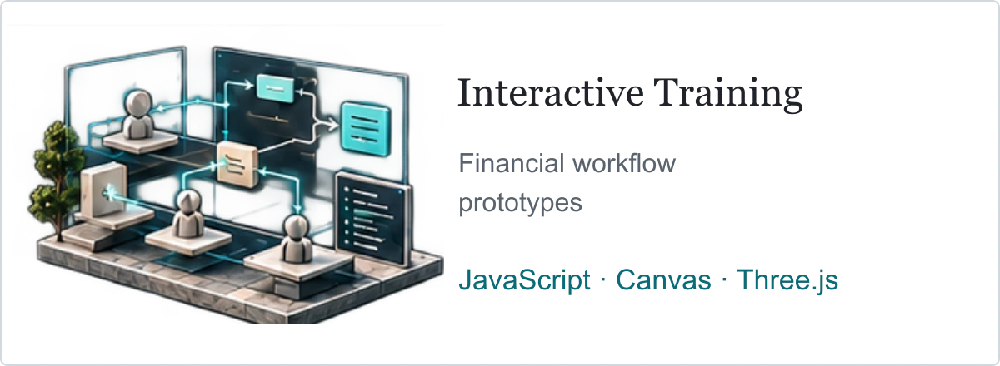</picture></a>
<a href="projects/sabapay.md" title="SabaPay — Merchant Discovery and Aggregation Platform"><picture><source media="(max-width: 600px) and (prefers-color-scheme: dark)" srcset="assets/v9/sabapay-mobile-dark.webp" /><source media="(max-width: 600px)" srcset="assets/v9/sabapay-mobile-light.webp" /><source media="(prefers-color-scheme: dark)" srcset="assets/v9/sabapay-dark.webp" />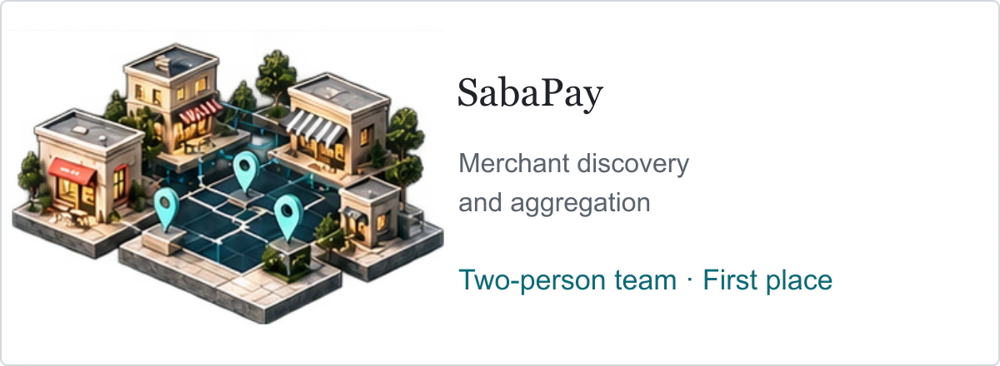</picture></a>

<a href="projects/rooyesh-adventure.md" title="Rooyesh — Path of the Sun"><picture><source media="(max-width: 600px) and (prefers-color-scheme: dark)" srcset="assets/v10/rooyesh-mobile-dark.webp" /><source media="(max-width: 600px)" srcset="assets/v10/rooyesh-mobile-light.webp" /><source media="(prefers-color-scheme: dark)" srcset="assets/v10/rooyesh-dark.webp" /></picture></a>

<a href="projects/magicvilla.md" title="MagicVilla — ASP.NET Core Web API Learning Project"><picture><source media="(max-width: 600px) and (prefers-color-scheme: dark)" srcset="assets/v9/magicvilla-mobile-dark.webp" /><source media="(max-width: 600px)" srcset="assets/v9/magicvilla-mobile-light.webp" /><source media="(prefers-color-scheme: dark)" srcset="assets/v9/magicvilla-dark.webp" /></picture></a>
<a href="projects/mango.md" title="Mango — .NET Microservices Learning Project"><picture><source media="(max-width: 600px) and (prefers-color-scheme: dark)" srcset="assets/v9/mango-mobile-dark.webp" /><source media="(max-width: 600px)" srcset="assets/v9/mango-mobile-light.webp" /><source media="(prefers-color-scheme: dark)" srcset="assets/v9/mango-dark.webp" />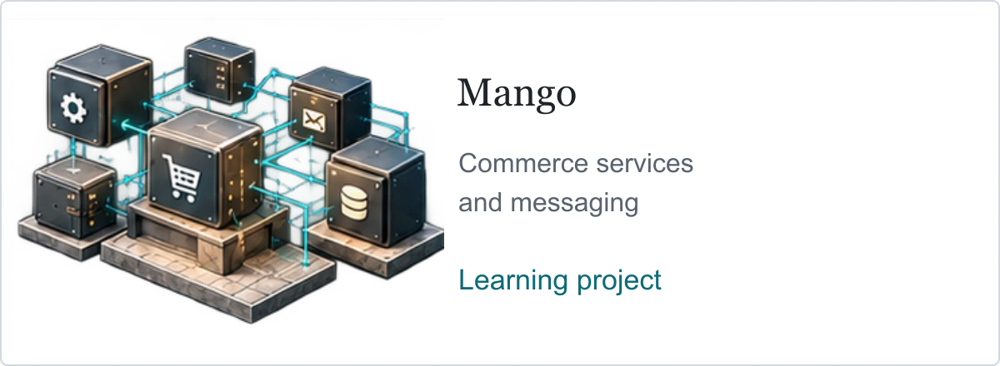</picture></a>

<picture><source media="(max-width: 600px) and (prefers-color-scheme: dark)" srcset="assets/v12/tab-engineering-mobile-dark.webp" /><source media="(max-width: 600px)" srcset="assets/v12/tab-engineering-mobile-light.webp" /><source media="(prefers-color-scheme: dark)" srcset="assets/v11/tab-engineering-dark.webp" />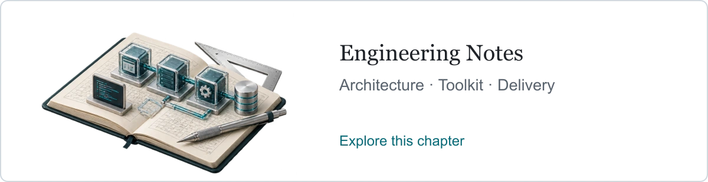</picture>

 

<a href="engineering-notes.md#architecture" title="Architecture &amp; APIs"><picture><source media="(max-width: 600px) and (prefers-color-scheme: dark)" srcset="assets/v12/architecture-mobile-dark.webp" /><source media="(max-width: 600px)" srcset="assets/v12/architecture-mobile-light.webp" /><source media="(prefers-color-scheme: dark)" srcset="assets/v11/architecture-dark.webp" />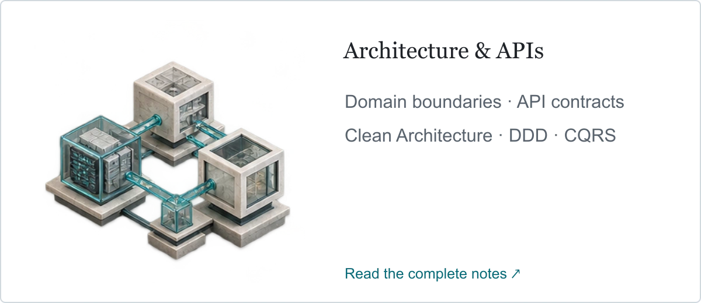</picture></a>
<a href="engineering-notes.md#architecture" title="Data &amp; reliability"><picture><source media="(max-width: 600px) and (prefers-color-scheme: dark)" srcset="assets/v12/reliability-mobile-dark.webp" /><source media="(max-width: 600px)" srcset="assets/v12/reliability-mobile-light.webp" /><source media="(prefers-color-scheme: dark)" srcset="assets/v11/reliability-dark.webp" />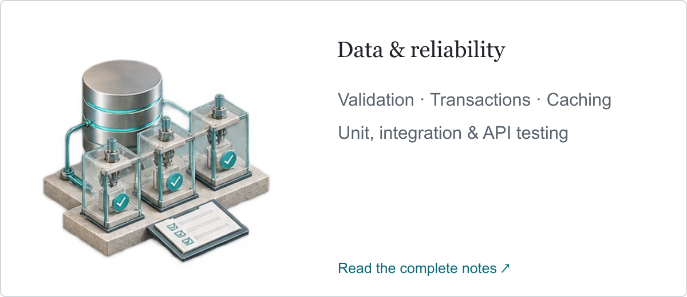</picture></a>

<a href="skills.md" title="Technical toolkit"><picture><source media="(max-width: 600px) and (prefers-color-scheme: dark)" srcset="assets/v12/toolkit-mobile-dark.webp" /><source media="(max-width: 600px)" srcset="assets/v12/toolkit-mobile-light.webp" /><source media="(prefers-color-scheme: dark)" srcset="assets/v11/toolkit-dark.webp" />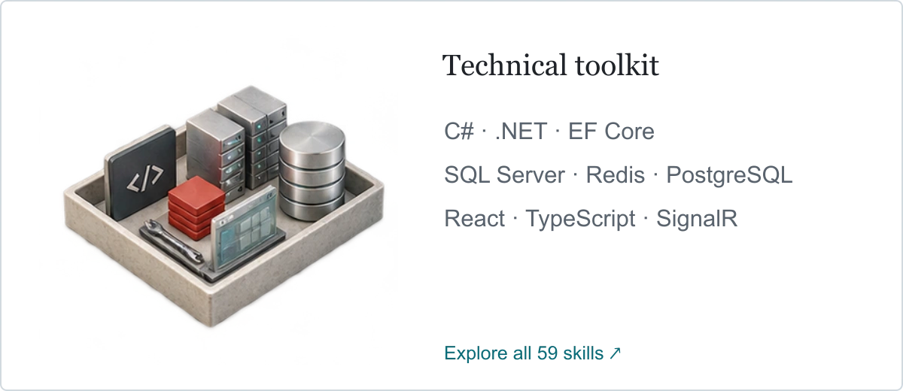</picture></a>
<a href="engineering-notes.md#workflow" title="Delivery &amp; practice"><picture><source media="(max-width: 600px) and (prefers-color-scheme: dark)" srcset="assets/v12/delivery-mobile-dark.webp" /><source media="(max-width: 600px)" srcset="assets/v12/delivery-mobile-light.webp" /><source media="(prefers-color-scheme: dark)" srcset="assets/v11/delivery-dark.webp" />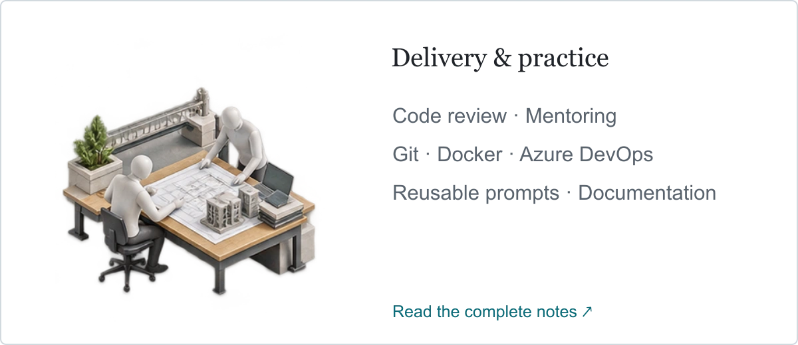</picture></a>

<a href="engineering-notes.md" title="Engineering practice &amp; all 59 skills"><picture><source media="(prefers-color-scheme: dark)" srcset="assets/v9/full-engineering-dark.webp" />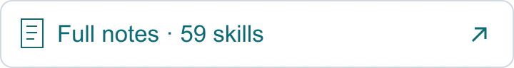</picture></a>

<picture><source media="(max-width: 600px) and (prefers-color-scheme: dark)" srcset="assets/v12/tab-professional-mobile-dark.webp" /><source media="(max-width: 600px)" srcset="assets/v12/tab-professional-mobile-light.webp" /><source media="(prefers-color-scheme: dark)" srcset="assets/v11/tab-professional-dark.webp" />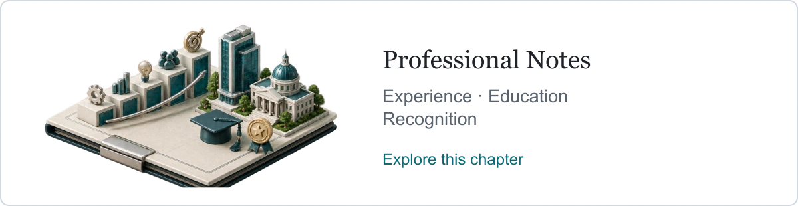</picture>

 

<a href="professional-notes.md#experience-sabatech" title="SabaTech"><picture><source media="(max-width: 600px) and (prefers-color-scheme: dark)" srcset="assets/v12/career-sabatech-mobile-dark.webp" /><source media="(max-width: 600px)" srcset="assets/v12/career-sabatech-mobile-light.webp" /><source media="(prefers-color-scheme: dark)" srcset="assets/v11/career-sabatech-dark.webp" />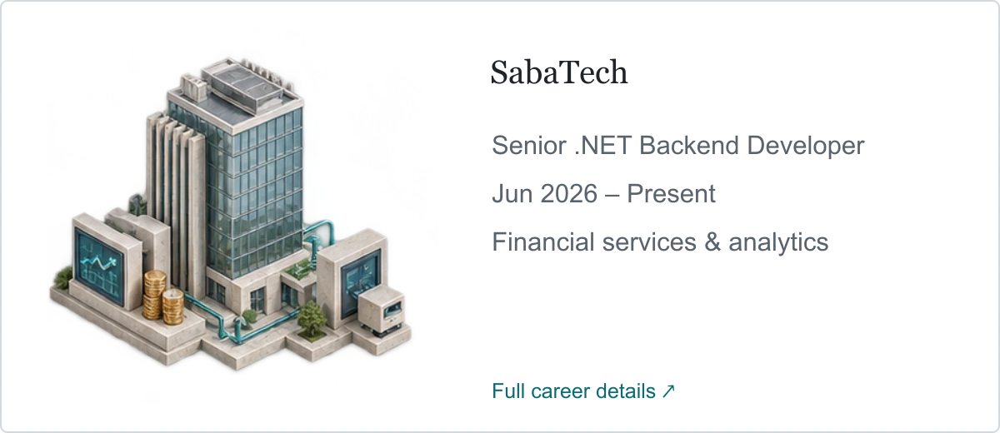</picture></a>
<a href="professional-notes.md#experience-independent" title="Independent work"><picture><source media="(max-width: 600px) and (prefers-color-scheme: dark)" srcset="assets/v12/career-independent-mobile-dark.webp" /><source media="(max-width: 600px)" srcset="assets/v12/career-independent-mobile-light.webp" /><source media="(prefers-color-scheme: dark)" srcset="assets/v11/career-independent-dark.webp" />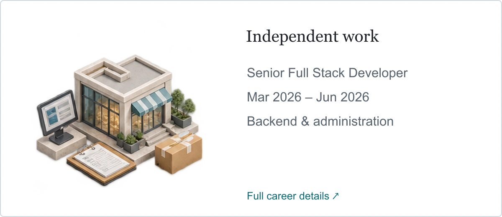</picture></a>

<a href="professional-notes.md#experience-ava" title="AVA Etminan"><picture><source media="(max-width: 600px) and (prefers-color-scheme: dark)" srcset="assets/v12/career-ava-mobile-dark.webp" /><source media="(max-width: 600px)" srcset="assets/v12/career-ava-mobile-light.webp" /><source media="(prefers-color-scheme: dark)" srcset="assets/v11/career-ava-dark.webp" />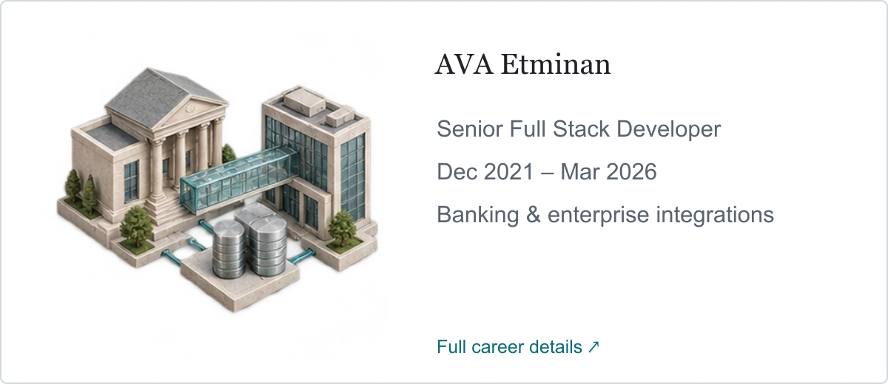</picture></a>
<a href="professional-notes.md#civil-background" title="Civil engineering roots"><picture><source media="(max-width: 600px) and (prefers-color-scheme: dark)" srcset="assets/v12/career-civil-mobile-dark.webp" /><source media="(max-width: 600px)" srcset="assets/v12/career-civil-mobile-light.webp" /><source media="(prefers-color-scheme: dark)" srcset="assets/v11/career-civil-dark.webp" />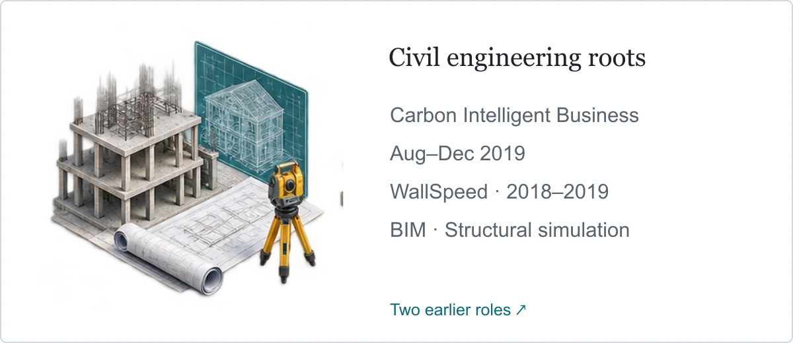</picture></a>

<a href="professional-notes.md#education" title="Master’s degree"><picture><source media="(max-width: 600px) and (prefers-color-scheme: dark)" srcset="assets/v12/masters-mobile-dark.webp" /><source media="(max-width: 600px)" srcset="assets/v12/masters-mobile-light.webp" /><source media="(prefers-color-scheme: dark)" srcset="assets/v11/masters-dark.webp" />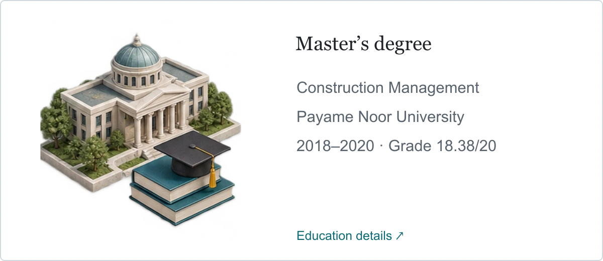</picture></a>
<a href="professional-notes.md#education" title="Bachelor’s degree"><picture><source media="(max-width: 600px) and (prefers-color-scheme: dark)" srcset="assets/v12/bachelors-mobile-dark.webp" /><source media="(max-width: 600px)" srcset="assets/v12/bachelors-mobile-light.webp" /><source media="(prefers-color-scheme: dark)" srcset="assets/v11/bachelors-dark.webp" />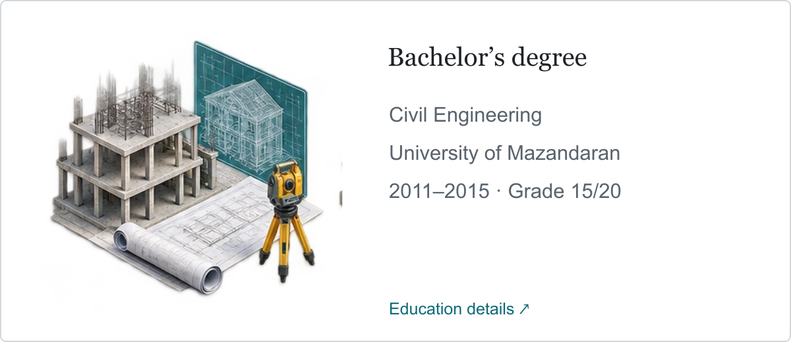</picture></a>

<a href="professional-notes.md#courses" title="Courses"><picture><source media="(max-width: 600px) and (prefers-color-scheme: dark)" srcset="assets/v12/courses-mobile-dark.webp" /><source media="(max-width: 600px)" srcset="assets/v12/courses-mobile-light.webp" /><source media="(prefers-color-scheme: dark)" srcset="assets/v11/courses-dark.webp" />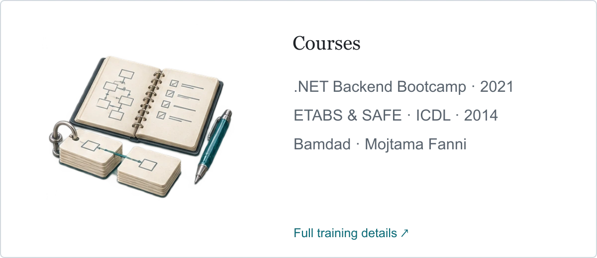</picture></a>
<a href="professional-notes.md#publication" title="EPC contract research"><picture><source media="(max-width: 600px) and (prefers-color-scheme: dark)" srcset="assets/v12/publication-mobile-dark.webp" /><source media="(max-width: 600px)" srcset="assets/v12/publication-mobile-light.webp" /><source media="(prefers-color-scheme: dark)" srcset="assets/v11/publication-dark.webp" />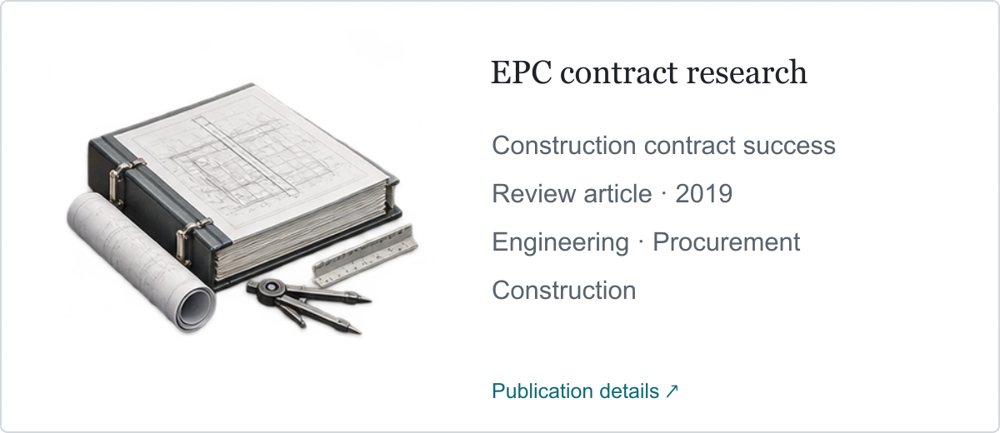</picture></a>

<a href="professional-notes.md#recognition" title="Hackathon first place"><picture><source media="(max-width: 600px) and (prefers-color-scheme: dark)" srcset="assets/v12/award-mobile-dark.webp" /><source media="(max-width: 600px)" srcset="assets/v12/award-mobile-light.webp" /><source media="(prefers-color-scheme: dark)" srcset="assets/v11/award-dark.webp" />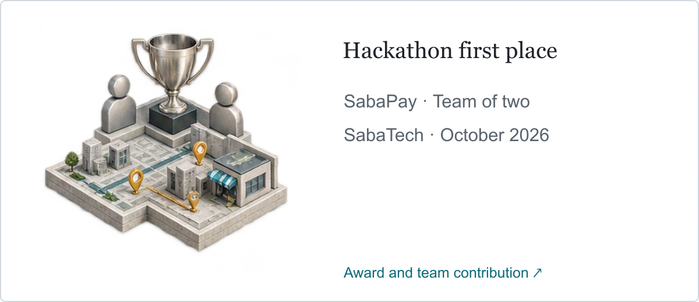</picture></a>
<a href="professional-notes.md#recommendation" title="Peer recommendation"><picture><source media="(max-width: 600px) and (prefers-color-scheme: dark)" srcset="assets/v12/reference-mobile-dark.webp" /><source media="(max-width: 600px)" srcset="assets/v12/reference-mobile-light.webp" /><source media="(prefers-color-scheme: dark)" srcset="assets/v11/reference-dark.webp" />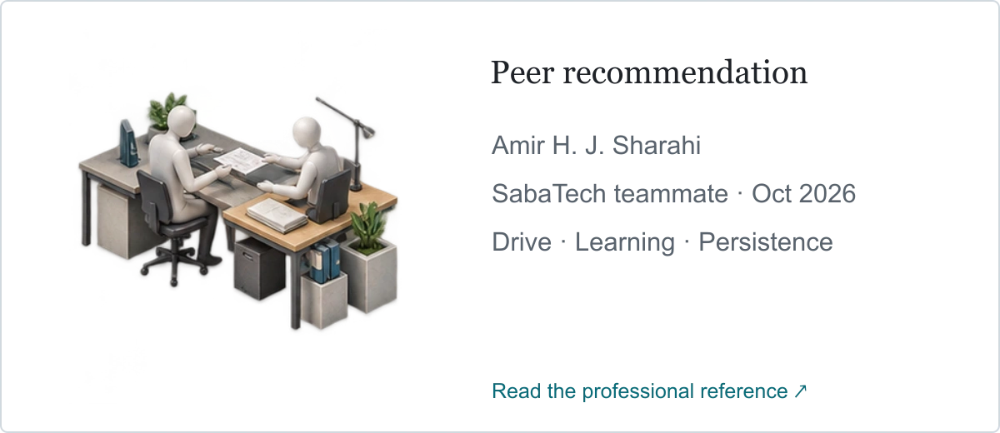</picture></a>

<a href="professional-notes.md#languages" title="Languages"><picture><source media="(max-width: 600px) and (prefers-color-scheme: dark)" srcset="assets/v12/languages-mobile-dark.webp" /><source media="(max-width: 600px)" srcset="assets/v12/languages-mobile-light.webp" /><source media="(prefers-color-scheme: dark)" srcset="assets/v11/languages-dark.webp" />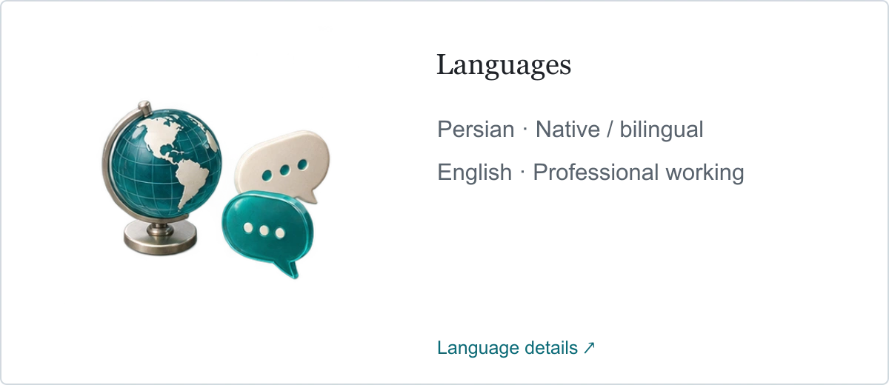</picture></a>

<a href="professional-notes.md" title="Read the complete professional background"><picture><source media="(prefers-color-scheme: dark)" srcset="assets/v9/full-professional-dark.webp" />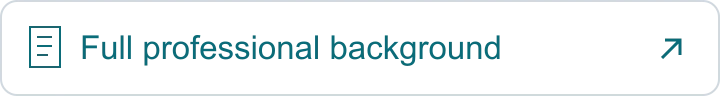</picture></a>

<picture><source media="(max-width: 600px) and (prefers-color-scheme: dark)" srcset="assets/v12/tab-archive-mobile-dark.webp" /><source media="(max-width: 600px)" srcset="assets/v12/tab-archive-mobile-light.webp" /><source media="(prefers-color-scheme: dark)" srcset="assets/v11/tab-archive-dark.webp" />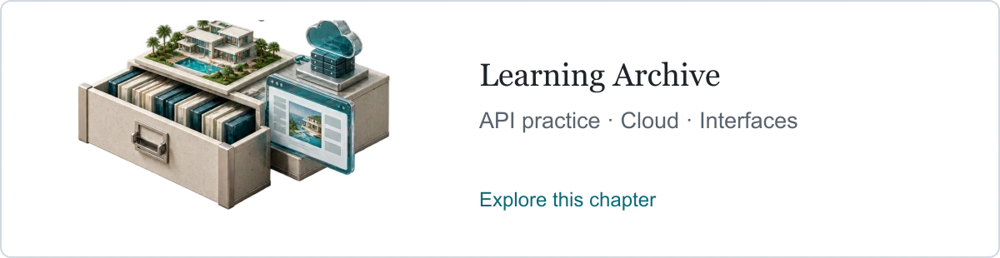</picture>

 

<a href="learning-archive.md#resort-mvc-ui-tour" title="Resort MVC — captured UI tour and repository"><picture><source media="(max-width: 600px) and (prefers-color-scheme: dark)" srcset="assets/v12/archive-resort-mobile-dark.webp" /><source media="(max-width: 600px)" srcset="assets/v12/archive-resort-mobile-light.webp" /><source media="(prefers-color-scheme: dark)" srcset="assets/v11/archive-resort-dark.webp" />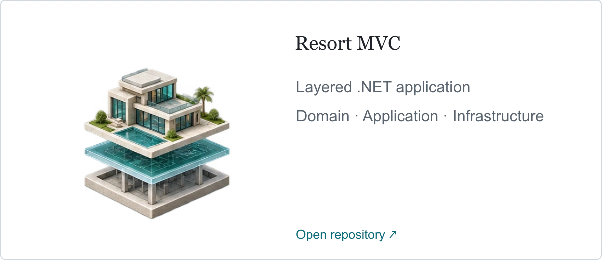</picture></a>
<a href="learning-archive.md#minimal-preview" title="Minimal API Coupon"><picture><source media="(max-width: 600px) and (prefers-color-scheme: dark)" srcset="assets/v12/archive-coupon-mobile-dark.webp" /><source media="(max-width: 600px)" srcset="assets/v12/archive-coupon-mobile-light.webp" /><source media="(prefers-color-scheme: dark)" srcset="assets/v11/archive-coupon-dark.webp" />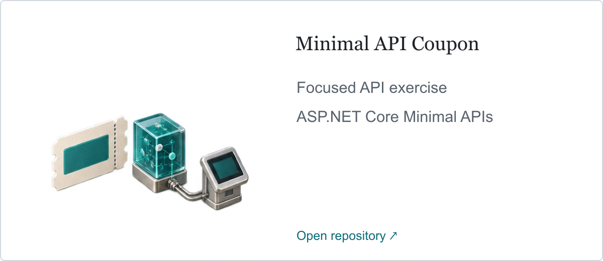</picture></a>

<a href="learning-archive.md#codingwiki-preview" title="CodingWiki EF"><picture><source media="(max-width: 600px) and (prefers-color-scheme: dark)" srcset="assets/v12/archive-ef-mobile-dark.webp" /><source media="(max-width: 600px)" srcset="assets/v12/archive-ef-mobile-light.webp" /><source media="(prefers-color-scheme: dark)" srcset="assets/v11/archive-ef-dark.webp" />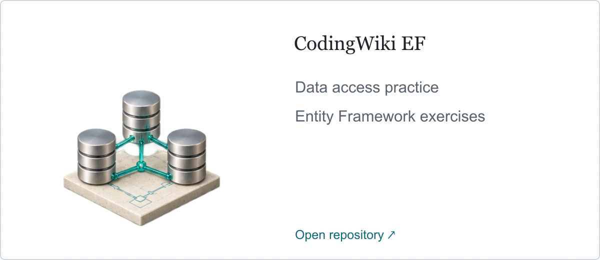</picture></a>
<a href="learning-archive.md#azure-preview" title="Azure Fundamentals"><picture><source media="(max-width: 600px) and (prefers-color-scheme: dark)" srcset="assets/v12/archive-azure-mobile-dark.webp" /><source media="(max-width: 600px)" srcset="assets/v12/archive-azure-mobile-light.webp" /><source media="(prefers-color-scheme: dark)" srcset="assets/v11/archive-azure-dark.webp" />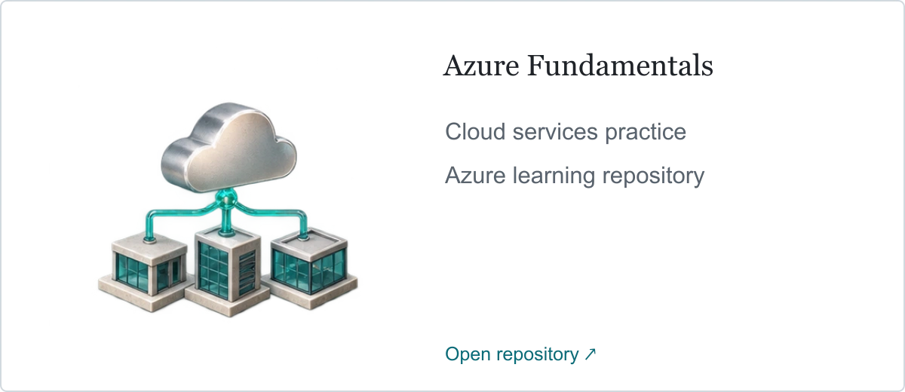</picture></a>

<a href="learning-archive.md#early-magic-preview" title="MagicVilla · Early API"><picture><source media="(max-width: 600px) and (prefers-color-scheme: dark)" srcset="assets/v12/archive-early-api-mobile-dark.webp" /><source media="(max-width: 600px)" srcset="assets/v12/archive-early-api-mobile-light.webp" /><source media="(prefers-color-scheme: dark)" srcset="assets/v11/archive-early-api-dark.webp" />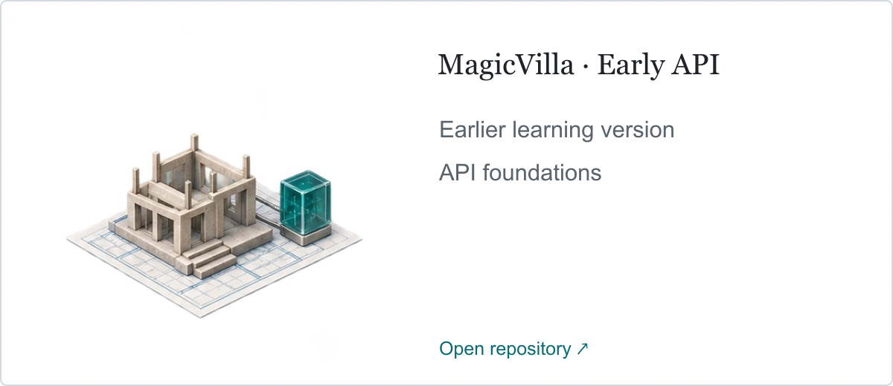</picture></a>
<a href="learning-archive.md#bulky-preview" title="Bulky MVC"><picture><source media="(max-width: 600px) and (prefers-color-scheme: dark)" srcset="assets/v12/archive-bulky-mobile-dark.webp" /><source media="(max-width: 600px)" srcset="assets/v12/archive-bulky-mobile-light.webp" /><source media="(prefers-color-scheme: dark)" srcset="assets/v11/archive-bulky-dark.webp" />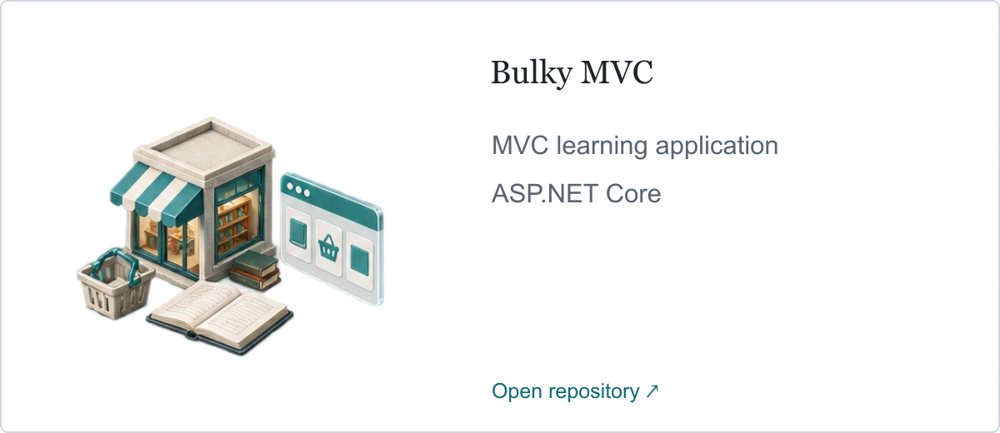</picture></a>

<a href="learning-archive.md#frontend-practice" title="Frontend practice"><picture><source media="(max-width: 600px) and (prefers-color-scheme: dark)" srcset="assets/v12/archive-frontend-mobile-dark.webp" /><source media="(max-width: 600px)" srcset="assets/v12/archive-frontend-mobile-light.webp" /><source media="(prefers-color-scheme: dark)" srcset="assets/v11/archive-frontend-dark.webp" />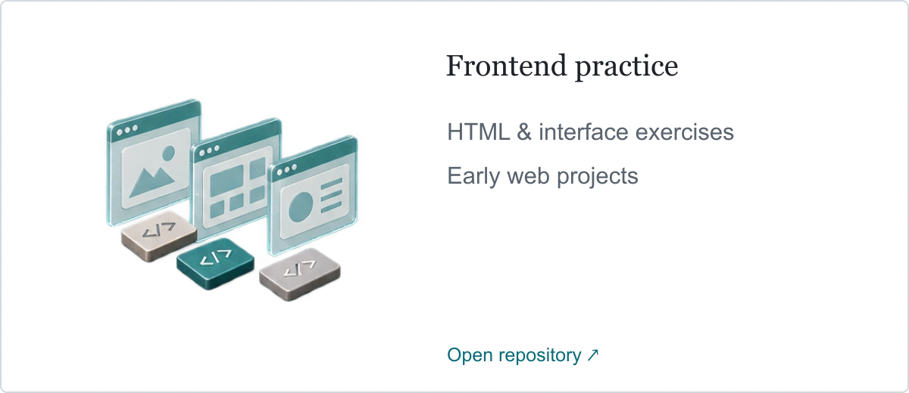</picture></a>

<a href="learning-archive.md" title="Explore the complete learning archive"><picture><source media="(prefers-color-scheme: dark)" srcset="assets/v9/full-archive-dark.webp" />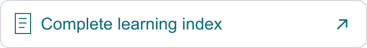</picture></a>

---

*Civil engineering roots. Software engineering practice.*

[LinkedIn](https://www.linkedin.com/in/hesam-shoushtarian/) · [Repositories](https://github.com/s-hesam-s?tab=repositories)

